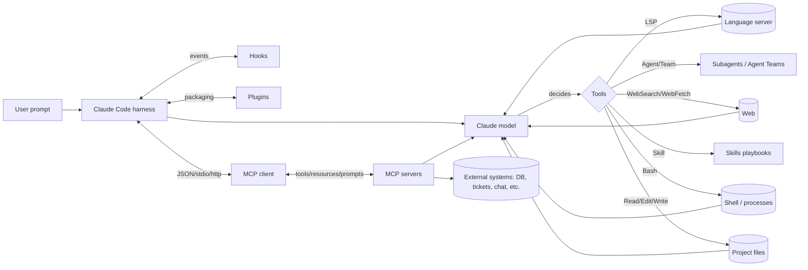

# Claude Code: Skills, Plugins, MCP und Command-Referenz

## Key outcomes

**Executive Summary (Stand: 03.04.2026, Europe/Berlin)**  
Claude Code ist ein agentisches Coding-Tool von entity["company","Anthropic","ai company"], das im Kern eine Claude‑Modellinstanz mit lokalen (und optional Cloud‑) Ausführungsumgebungen, einem Tool‑/Permission‑System und einer Erweiterungsschicht (CLAUDE.md, Skills, Hooks, Plugins, MCP, Subagents, Agent Teams) kombiniert. Es liest Code, editiert Dateien, führt Shell‑Kommandos aus, kann Web‑Recherche/FETCH nutzen und lässt sich über den Model Context Protocol (MCP)‑Standard mit externen Systemen verbinden. citeturn16view0turn17view0turn12view0turn21view0  

**Was du in diesem Report bekommst**  
Du erhältst (1) eine einsteigerfreundliche Kurz‑Einführung inkl. Quickstarts, (2) ein präzises Begriffs‑/Architekturmodell (inkl. Mermaid‑Diagrammen), (3) vollständige Listen der offiziellen CLI‑ und Slash‑Commands, Built‑in Tools, Bundled Skills, MCP‑ und Plugin‑Kommandos, (4) Plugin‑/MCP‑Architektur inklusive Scopes, Manifest‑Schema, Security‑Grenzen, (5) SDK/API‑Details (Messages API, Tool Use, Agent SDK/Tool Runner) und (6) 15 außergewöhnlich kreative, aber praktisch umsetzbare Use Cases mit Implementierungs‑Blueprints inkl. Risiken & Mitigations. citeturn10view0turn7view0turn9view0turn8view0turn24view0turn12view0turn19search4turn19search5  

**Einsteiger‑Intro: Was sind Claude, Claude Code, Skills/Plugins/MCP?**  
Claude ist eine Modellfamilie (Haiku/Sonnet/Opus) mit unterschiedlichen Trade‑offs aus Kosten, Latenz und Fähigkeit. Claude Code ist das „Harness“ darum: ein agentischer Loop („Kontext sammeln → handeln → verifizieren“) plus Tooling (Read/Edit/Write/Bash/WebSearch/…​), Session‑/Context‑Management und Sicherheits‑/Permission‑Schichten. citeturn17view0turn9view0turn5search0turn5search1  
Die wichtigsten Konzepte in Claude Code:  
- **Modelle**: Wahl via `/model` oder `claude --model …`; Effort/Thinking beeinflusst Qualität/Kosten/Latenz. citeturn7view0turn5search6turn27view0turn19search18  
- **Prompts**: normale Chat‑Prompts + (optional) systematische Prompt‑Artefakte (CLAUDE.md, Skills). citeturn30view0turn8view0  
- **CLAUDE.md (Memory‑Ebene)**: persistente Projekt-/User-/Org‑Instruktionen, die zu Session‑Start in den Kontext geladen werden. citeturn30view0turn30view1  
- **Skills**: dateibasierte, on‑demand geladene „Playbooks“ (SKILL.md), die du per `/skill-name` aufrufst oder die Claude automatisch lädt; kompatibel mit einem offenen Agent‑Skills‑Standard. citeturn8view0turn3search11  
- **Hooks**: deterministische Automationen, die an Lifecycle‑Events feuern (PreToolUse/PostToolUse/…​), als Shell‑Command, HTTP‑Call, Prompt‑Hook oder Agent‑Hook. citeturn3search1turn11view0  
- **Plugins**: das Packaging‑Layer: bündeln Skills, Agents, Hooks, MCP‑Server, LSP‑Server, Output‑Styles, optional Binärtools; installierbar über Marketplaces mit Scopes. citeturn3search24turn24view0turn23view0  
- **MCP (Model Context Protocol)**: offener Standard (JSON‑RPC‑basiert) für Tool‑/Resource‑/Prompt‑Integrationen; Claude Code kann MCP‑Server anbinden und so externe Systeme als Tools/Resources/Prompts nutzen. citeturn21view0turn12view0  

**Quickstart in 90 Sekunden (Terminal, minimal)**  
1) Installieren (OS‑abhängig) und im Repo starten: Claude Code CLI installieren, `cd` ins Projekt, `claude` starten. citeturn16view0turn10view0  
2) Projekt‑Onboarding generieren: `/init` erzeugt/verbessert eine projektweite CLAUDE.md (ggf. interaktiver Flow über Env‑Flag). citeturn7view0turn30view0  
3) Tool‑Grenzen setzen: Modus per Shift+Tab (default → acceptEdits → plan), oder per Flag `--permission-mode`. citeturn27view0turn10view0  
4) Externe Tools anbinden: MCP‑Server hinzufügen (`claude mcp add …`) und in der Session `/mcp` checken. citeturn12view0turn7view0  

## Changes made

**Scope‑Entscheidung**  
Fokus ist Claude Code (CLI/IDE/Desktop/Web) + Erweiterungssystem (Skills/Hooks/Plugins/MCP) + offizielle API‑/SDK‑Details, soweit sie Claude Code direkt betreffen (insb. Agent SDK und Tool‑Use‑Konzept). citeturn16view0turn19search4turn18view0turn12view0  

**Unspecified → explizit markiert**  
- **Account‑Typ/Plan** ist **nicht angegeben**. Viele Features sind plan‑/plattform‑/provider‑abhängig (z. B. Auto‑Mode nur Team/Enterprise/API; bestimmte Commands nur macOS/Windows; Remote/Cloud‑Sessions vs lokal). Deshalb werden Abhängigkeiten jeweils genannt. citeturn7view0turn27view0turn16view0  

**Datenstand & Quellenpriorität**  
- Datumsstand: **03.04.2026** (für Preise/Kommandos/Feature‑Gating). citeturn6view0turn20view0turn7view0  
- Priorisierung: Offizielle Docs (code.claude.com, platform.claude.com, anthropic.com, modelcontextprotocol.io), ergänzt um wenige aktuelle, autoritative Sekundärquellen für „Ecosystem‑Risks“ (z. B. Security‑Paper zu Skills‑Marketplaces). citeturn21view0turn3academia37  

## Artifacts/Files

### Offizielle Dokumentation & Primärquellen (Link‑Index)
> Hinweis: URLs sind hier als Copy‑Paste‑Liste in einem Codeblock (zusätzlich zu Inline‑Citations) – so bleiben sie „echte Links“ ohne Markdown‑Link‑Format.

```text
Claude Code Docs (Overview): https://code.claude.com/docs/en/overview
Claude Code Docs (How it works): https://code.claude.com/docs/en/how-claude-code-works
Claude Code Docs (Built-in commands): https://code.claude.com/docs/en/commands
Claude Code Docs (CLI reference): https://code.claude.com/docs/en/cli-reference
Claude Code Docs (Tools reference): https://code.claude.com/docs/en/tools-reference
Claude Code Docs (Skills): https://code.claude.com/docs/en/skills
Claude Code Docs (Hooks reference): https://code.claude.com/docs/en/hooks
Claude Code Docs (Plugins guide): https://code.claude.com/docs/en/plugins
Claude Code Docs (Plugins reference): https://code.claude.com/docs/en/plugins-reference
Claude Code Docs (MCP in Claude Code): https://code.claude.com/docs/en/mcp
Claude Code Docs (Permissions): https://code.claude.com/docs/en/permissions
Claude Code Docs (Permission modes): https://code.claude.com/docs/en/permission-modes
Claude Code Docs (Security): https://code.claude.com/docs/en/security
Claude Code Docs (Data usage): https://code.claude.com/docs/en/data-usage
Claude Code Docs (Zero data retention): https://code.claude.com/docs/en/zero-data-retention
Claude Code Docs (Sandboxing): https://code.claude.com/docs/en/sandboxing
Claude Code Docs (Memory/CLAUDE.md & auto memory): https://code.claude.com/docs/en/memory
Claude Code Docs (Explore .claude directory): https://code.claude.com/docs/en/claude-directory
Claude Code Docs (Changelog): https://code.claude.com/docs/en/changelog

Claude Platform Docs (Models overview): https://platform.claude.com/docs/en/about-claude/models/overview
Claude Platform Docs (Context windows): https://platform.claude.com/docs/en/build-with-claude/context-windows
Claude Platform Docs (Pricing): https://platform.claude.com/docs/en/about-claude/pricing
Claude Platform API Ref (Messages create): https://platform.claude.com/docs/en/api/messages/create
Claude Platform Docs (Tool use overview): https://platform.claude.com/docs/en/agents-and-tools/tool-use/overview
Claude Platform Docs (Agent SDK overview): https://platform.claude.com/docs/en/agent-sdk/overview

MCP Specification (latest): https://modelcontextprotocol.io/specification/2025-11-25
Anthropic announcement (MCP): https://www.anthropic.com/news/model-context-protocol

Claude pricing (consumer/team/api overview): https://claude.com/pricing
```

Diese Liste basiert auf den im Report zitierten Primärseiten. citeturn16view0turn17view0turn7view0turn10view0turn9view0turn8view0turn3search1turn3search24turn11view0turn12view0turn13view0turn14view0turn15view0turn28view0turn30view0turn30view1turn21view0turn22view0turn6view0  

### Modellvarianten im Claude‑Ökosystem (Vergleichstabelle)
**Wichtig:** Offizielle Dokumentation zu Modell‑Lineups kann kurzfristig „hinterherhinken“; es existieren auch öffentliche Issues zu veralteten Stellen. Der Stand unten ist aus den neueren Modell‑ und Context‑Docs abgeleitet. citeturn5search1turn5search19turn5search22turn6view0  

| Modell (Alias/ID) | Typischer Einsatz | Kontextfenster | Max Output | Preis (API, $/MTok) | Hinweise |
|---|---|---:|---:|---:|---|
| Opus 4.6 (`claude-opus-4-6`) | schwierigste Coding-/Reasoning‑Tasks, Agenten | 1M Tokens (beta) | 128k Tokens | In: 5 / Out: 25 | „Best“/`opus`‑Alias in Claude Code zeigt aktuell auf Opus 4.6. citeturn5search1turn5search19turn5search6turn6view0 |
| Sonnet 4.6 (`claude-sonnet-4-6`) | „Daily driver“, starkes P‑/C‑Verhältnis | 1M Tokens (beta) | 64k Tokens | In: 3 / Out: 15 | In Claude Code als `sonnet`‑Alias geführt; eignet sich auch als Auto‑Mode‑/Classifier‑Basis. citeturn5search1turn5search19turn5search6turn27view0turn6view0 |
| Haiku 4.5 (`claude-haiku-4-5` / Snapshot `…-20251001`) | schnelle, günstige Teilaufgaben | (typisch) 200k Tokens | (modellabhängig) | In: 1 / Out: 5 | Häufig für Subagent‑„Micro‑Tasks“ oder Routinen. citeturn5search1turn5search4turn6view0turn26view0 |

### Claude Code Erweiterungs‑/Automations‑Schicht (Feature‑Vergleich)
| Mechanismus | Wofür | Laden/Scope | „Deterministisch“? | Typische Risiken |
|---|---|---|---|---|
| CLAUDE.md + Rules | persistente Standards/Policies | bei Session‑Start (voll), Subdir‑Files on‑demand | nein (Kontext, keine Enforcement) | Token‑Overhead, vage Regeln → geringe Adhärenz citeturn30view0turn17view0turn26view0 |
| Skills (SKILL.md) | wiederholbare Workflows/Know‑how | on‑demand (Inhalt lädt bei Nutzung) | nein (Prompt‑Playbook), aber steuerbar | falsche Tool‑Freigaben, Over‑Automation citeturn8view0turn17view0turn9view0 |
| Hooks | Guardrails + Automation (pre/post Events) | eventbasiert | ja („garantiert feuern“) | unsafe shell scripts, Hook‑Looping, falsche Matcher citeturn3search1turn3search4turn11view0turn26view0 |
| Plugins | Packaging/Distribution (Skills/Agents/Hooks/MCP/LSP/Bin) | installierbar via Marketplaces + Scopes | gemischt (Hooks deterministisch, Skills promptbasiert) | Supply‑Chain‑Risiko; Plugin‑Code/MCP‑Server untrusted citeturn24view0turn23view0turn13view0 |
| MCP | Tools/Resources/Prompts aus externen Systemen | serverbasiert; Scopes user/project/local | je nach Tool | Prompt Injection, Datenexfiltration, OAuth‑/Token‑Risiken citeturn12view0turn21view0turn13view0turn14view0 |
| Subagents | Kontext‑Isolation + Parallelisierung | innerhalb einer Session | nein (Agent‑Loop), aber isoliert | zusätzliche Kosten/Token, falsche Tool‑Scopes citeturn17view0turn4search8turn9view0 |
| Agent Teams | echte Multi‑Session‑Koordination | mehrere Claude Code Instanzen | nein | hoher Token‑Multiplikator, Koordinationsfehler citeturn4search0turn9view0turn26view0 |

### Architektur‑Diagramme (Mermaid)

**Claude Code: Agentic Loop + Extension‑Layer (vereinfacht)** citeturn17view0turn9view0turn12view0turn24view0  


**MCP: Host/Client/Server Rollenmodell** citeturn21view0turn12view0  
```mermaid
flowchart TB
  Host[Host: LLM application\n(e.g., Claude Code)] --> Client[Client: connector inside host]
  Client -->|JSON-RPC 2.0| Server[MCP server]
  Server --> R[Resources]
  Server --> P[Prompts]
  Server --> Tools[Tools]
  Client --> E[Elicitation (ask user)]
  Client --> Roots[Roots (boundaries)]
```

### Komplette Command‑Referenz (Slash‑Commands in Claude Code)
Quelle ist die offizielle „Built‑in commands“ Referenz; nicht alle Commands sind überall sichtbar (Plan/Plattform/Environment‑abhängig). citeturn7view0  

| Command | Zweck | Syntax/Beispiel (minimal) |
|---|---|---|
| `/add-dir` | zusätzlichen Working‑Dir für File‑Access hinzufügen | `/add-dir ../lib` citeturn7view0 |
| `/agents` | Subagent‑Konfiguration verwalten | `/agents` citeturn7view0 |
| `/btw` | Side‑Question ohne Kontext‑Verschmutzung | `/btw what is X?` citeturn7view0 |
| `/chrome` | Chrome‑Integration konfigurieren | `/chrome` citeturn7view0 |
| `/clear` | Conversation löschen (Aliases: /reset, /new) | `/clear` citeturn7view0 |
| `/color` | Prompt‑Bar Farbe | `/color cyan` citeturn7view0 |
| `/compact` | Kontext kompaktieren | `/compact focus on API changes` citeturn7view0 |
| `/config` | Settings UI (Alias /settings) | `/config` citeturn7view0 |
| `/context` | Context‑Usage visualisieren | `/context` citeturn7view0 |
| `/copy` | letzter Assist‑Output kopieren | `/copy 2` citeturn7view0 |
| `/cost` | Token‑Kosten/Usage (primär API‑User) | `/cost` citeturn7view0turn26view0 |
| `/desktop` | Session in Desktop‑App fortsetzen | `/desktop` citeturn7view0 |
| `/diff` | interaktiver Diff Viewer | `/diff` citeturn7view0 |
| `/doctor` | Diagnose Installation/Settings | `/doctor` citeturn7view0 |
| `/effort` | Effort‑Level | `/effort high` citeturn7view0turn27view0 |
| `/exit` | CLI verlassen | `/exit` citeturn7view0 |
| `/export` | Conversation exportieren | `/export session.txt` citeturn7view0 |
| `/extra-usage` | Extra‑Usage konfigurieren | `/extra-usage` citeturn7view0 |
| `/fast` | Fast‑Mode togglen | `/fast on` citeturn7view0 |
| `/feedback` | Feedback/Bug report (Alias /bug) | `/feedback found issue...` citeturn7view0turn14view0 |
| `/branch` | Conversation‑Branch (Alias /fork) | `/branch experiment` citeturn7view0 |
| `/help` | Hilfe/Commands | `/help` citeturn7view0 |
| `/hooks` | Hook‑Konfigurationen ansehen | `/hooks` citeturn7view0turn30view1 |
| `/ide` | IDE Integrationen | `/ide` citeturn7view0 |
| `/init` | Projekt initialisieren (CLAUDE.md) | `/init` citeturn7view0turn30view0 |
| `/insights` | Session‑Report (Patterns/Friction) | `/insights` citeturn7view0 |
| `/install-github-app` | GitHub Actions App Setup | `/install-github-app` citeturn7view0 |
| `/install-slack-app` | Slack App installieren | `/install-slack-app` citeturn7view0 |
| `/keybindings` | Keybindings config | `/keybindings` citeturn7view0 |
| `/login` | einloggen | `/login` citeturn7view0 |
| `/logout` | ausloggen | `/logout` citeturn7view0 |
| `/mcp` | MCP Server + OAuth verwalten | `/mcp` citeturn7view0turn12view0 |
| `/memory` | CLAUDE.md/Auto‑Memory verwalten | `/memory` citeturn7view0turn30view0turn30view1 |
| `/mobile` | QR für Mobile App | `/mobile` citeturn7view0 |
| `/model` | Modell wählen | `/model sonnet` citeturn7view0turn5search6 |
| `/passes` | free week share (eligibility) | `/passes` citeturn7view0 |
| `/permissions` | Allow/Ask/Deny Regeln | `/permissions` citeturn7view0turn25search6turn30view1 |
| `/plan` | Plan‑Mode direkt starten | `/plan fix auth bug` citeturn7view0turn27view0 |
| `/plugin` | Plugins verwalten | `/plugin` citeturn7view0turn24view0 |
| `/powerup` | Feature‑Lessons | `/powerup` citeturn7view0 |
| `/pr-comments` | PR‑Kommentare fetchen | `/pr-comments 123` citeturn7view0 |
| `/privacy-settings` | Privacy Settings (Pro/Max) | `/privacy-settings` citeturn7view0turn14view0 |
| `/release-notes` | Changelog im Prompt | `/release-notes` citeturn7view0turn20view0 |
| `/reload-plugins` | Plugins live reload | `/reload-plugins` citeturn7view0turn3search24turn24view0 |
| `/remote-control` (`/rc`) | Remote Control Session enable | `/rc` citeturn7view0turn4search1 |
| `/remote-env` | Remote Env default | `/remote-env` citeturn7view0 |
| `/rename` | Session umbenennen | `/rename "my task"` citeturn7view0 |
| `/resume` | Session fortsetzen | `/resume auth-refactor` citeturn7view0turn17view0 |
| `/review` | deprecated | (install code-review plugin) citeturn7view0turn23view0 |
| `/rewind` | Checkpoints/rewind | `/rewind` citeturn7view0turn17view0 |
| `/sandbox` | Sandbox mode togglen | `/sandbox` citeturn7view0turn28view0turn13view0 |
| `/schedule` | Cloud scheduled tasks | `/schedule nightly PR review` citeturn7view0turn16view0 |
| `/security-review` | Security‑Diff Review | `/security-review` citeturn7view0turn13view0 |
| `/skills` | Skills listen | `/skills` citeturn7view0turn30view1 |
| `/stats` | Usage/Streaks | `/stats` citeturn7view0turn26view0 |
| `/status` | Status Tab | `/status` citeturn7view0 |
| `/statusline` | Status Line config | `/statusline` citeturn7view0turn26view0 |
| `/tasks` (`/bashes`) | Background tasks | `/tasks` citeturn7view0turn3search9 |
| `/terminal-setup` | Keybindings setup | `/terminal-setup` citeturn7view0 |
| `/theme` | Theme ändern | `/theme` citeturn7view0 |
| `/ultraplan` | Browser‑Plan + execute | `/ultraplan <prompt>` citeturn7view0turn27view0 |
| `/upgrade` | Upgrade Plan | `/upgrade` citeturn7view0turn6view0 |
| `/usage` | Usage limits | `/usage` citeturn7view0turn6view0 |
| `/vim` | Vim mode toggle | `/vim` citeturn7view0 |
| `/voice` | Voice dictation | `/voice` citeturn7view0 |

**Dynamische MCP‑Prompts als Slash‑Commands**  
MCP‑Server können Prompts exponieren, die dann als Commands erscheinen: `/mcp__<server>__<prompt>`. citeturn7view0turn12view0turn21view0  

### Bundled Skills (in jeder Session verfügbar)
Bundled Skills sind prompt‑basierte Playbooks (anders als Built‑in Commands, die fixe Logik ausführen). citeturn8view0turn7view0  

| Skill | Zweck | Minimales Beispiel |
|---|---|---|
| `/batch <instruction>` | parallele, großflächige Codebase‑Änderungen via Worktrees | `/batch migrate src/ from Solid to React` citeturn8view0 |
| `/claude-api` | lädt API‑Referenzmaterial + Agent SDK Doku passend zur Sprache | `/claude-api` citeturn8view0turn19search4turn19search5 |
| `/debug [desc]` | Debug‑Logging aktivieren und Log analysieren | `/debug failing mcp auth` citeturn8view0turn10view0 |
| `/loop [interval] <prompt>` | Prompt periodisch ausführen | `/loop 5m check deploy status` citeturn8view0turn7view0 |
| `/simplify [focus]` | Parallel‑Reviews + Fixes auf „recently changed files“ | `/simplify focus on perf` citeturn8view0 |

### Built‑in Tools (die Claude Code ausführen kann)
Tool‑Namen sind die Strings für Permission Rules / Hook Matcher / Subagent Tool lists. citeturn9view0turn13view0turn27view0  

| Tool | Funktion | Permission erforderlich? |
|---|---|---|
| `Read` | Dateien lesen | nein citeturn9view0 |
| `Edit` / `Write` / `NotebookEdit` | gezielt editieren / schreiben / Notebooks | ja citeturn9view0 |
| `Bash` | Shell Commands (nicht persistent für env vars) | ja citeturn9view0 |
| `WebSearch` / `WebFetch` | Web‑Suche / URL Fetch | ja citeturn9view0turn13view0 |
| `LSP` | Code‑Intelligence via Language Server | nein (aber Setup nötig) citeturn9view0turn24view0 |
| `Skill` | Skill ausführen | ja citeturn9view0turn8view0 |
| `Agent` | Subagent spawnen | nein citeturn9view0turn4search8 |
| `TeamCreate` / `SendMessage` | Agent Teams (experimental flag) | nein citeturn9view0turn4search0turn26view0 |
| `Task*` / `Cron*` | Background tasks & schedules innerhalb Session | nein citeturn9view0turn7view0 |

**Tool‑Verfügbarkeit ist provider/platform/settings‑abhängig**; PowerShell‑Tool ist Preview mit Einschränkungen (kein Auto‑Mode, kein Sandboxing, nicht WSL). citeturn9view0turn28view0turn27view0  

### CLI: Kommandos & Flags (kompletter Auszug aus offizieller CLI‑Referenz)
Die CLI‑Referenz dokumentiert Start/Resume/Print‑Mode, Auth, MCP, Plugin‑Management, Remote Control und viele Flags. citeturn10view0  

**CLI‑Kommandos (Auswahl, aber vollständig in der Referenz‑Tabelle)**  
- `claude` (interactive), `claude "query"`, `claude -p "query"` (print/SDK mode) citeturn10view0  
- `claude -c` / `--continue`, `claude -r/--resume` (Session resume) citeturn10view0turn17view0  
- `claude update` (Update) citeturn10view0turn20view0  
- `claude auth login|logout|status` (Auth; Console vs Subscription) citeturn10view0turn16view0  
- `claude mcp …` (MCP config) citeturn10view0turn12view0  
- `claude plugin …` (Plugin install/enable/disable/update) citeturn10view0turn24view0  
- `claude remote-control …` (Server‑Mode Remote Control) citeturn10view0turn4search1  

**Flags (high‑leverage, inkl. Sicherheits-/Automations‑Flags)**  
- `--permission-mode {default|acceptEdits|plan|auto|dontAsk|bypassPermissions}` citeturn10view0turn27view0  
- `--dangerously-skip-permissions` / `--allow-dangerously-skip-permissions` (riskant) citeturn10view0turn13view0turn27view0  
- `--enable-auto-mode` (nur Team/Enterprise/API + Sonnet/Opus 4.6 + Anthropic API) citeturn10view0turn27view0  
- `--mcp-config` / `--strict-mcp-config` (MCP‑Server aus JSON) citeturn10view0turn12view0  
- `--plugin-dir` (lokale Plugin‑Dirs laden) citeturn10view0turn24view0  
- `--json-schema` (validated JSON output, print mode; structured outputs) citeturn10view0turn5search25turn19search5  
- `--worktree/-w` (isolierte git worktrees) citeturn10view0turn17view0turn8view0  

### MCP (Meaning, Rolle, Setup, Limits)
**Definition & Rolle**  
MCP ist ein offenes Protokoll für standardisierte Integrationen zwischen LLM‑Hosts und externen Daten/Tools (JSON‑RPC 2.0; Rollen: Host/Client/Server; Features: Resources/Prompts/Tools; plus Elicitation/Roots/Sampling). citeturn21view0turn22view0  
In Claude Code bedeutet das praktisch: Du bindest MCP‑Server an, und Claude Code „sieht“ zusätzliche Tools/Resources/Prompts, die in den Agentic Loop integriert werden. citeturn12view0turn17view0turn9view0  

**Installation/Management (CLI)**  
- Empfehlung: Remote HTTP‑Server (`--transport http`)  
- SSE ist als Transport **deprecated**  
- Local stdio‑Server: läuft als lokaler Prozess und ist ideal für System‑Zugriff/Custom Scripts citeturn12view0  

Minimaler CLI‑Ablauf (Syntax ist offiziell dokumentiert):  
- `claude mcp add --transport http <name> <url> [--header …]` citeturn12view0  
- `claude mcp list|get|remove …` + in‑session `/mcp` Status/OAuth citeturn12view0turn7view0  

**OAuth & Auth**  
Claude Code kann OAuth‑Flows für kompatible remote MCP‑Server (Callback‑Port fixierbar, preconfigured creds möglich). citeturn12view0  

**Output‑Limits**  
Claude Code warnt bei sehr großen MCP‑Tool‑Outputs (Warnschwelle 10k Tokens; Default‑Max 25k Tokens; per Tool via `_meta["anthropic/maxResultSizeChars"]` bis Hard‑Ceiling 500k chars override möglich). citeturn12view0turn20view0  

**Security‑Realität**  
Offizielle Warnung: Third‑party MCP‑Server sind „use at your own risk“; besondere Vorsicht bei Servern, die untrusted content holen können (Prompt‑Injection‑Risiko). citeturn12view0turn13view0turn21view0  

### Plugins (Architektur, Komponenten, CLI, Marketplaces)
**Plugin‑Definition**  
Plugins sind eigenständige Verzeichnisse von Komponenten (Skills, Agents, Hooks, MCP‑Server, LSP‑Server). Ziel: Wiederverwendbarkeit, Team‑Rollout, Distribution via Marketplaces. citeturn3search24turn11view0turn24view0  

**Komponenten‑Set (offiziell)**  
- Skills/Commands werden automatisch discovered; Skills sind `/plugin-name:skill` namespaced. citeturn3search24turn11view0  
- Plugin‑Agents sind Subagents mit Frontmatter‑Feldern; aus Security‑Gründen sind z. B. `hooks`, `mcpServers`, `permissionMode` in plugin‑shipped agents nicht unterstützt. citeturn11view0  
- Hooks: gleiche Lifecycle‑Events wie User‑Hooks; Hook‑Types: command/http/prompt/agent. citeturn11view0turn3search1  
- MCP‑Server können als `.mcp.json` oder inline in plugin.json gebündelt werden. citeturn11view0turn24view0  
- `bin/` kann Executables ausliefern, die während Plugin‑Enablement im Bash‑PATH verfügbar sind (auch im Changelog als Neuheit erwähnt). citeturn24view0turn20view0  

**Directory‑Layout (Standard, offiziell)** citeturn24view0turn23view0  
- `.claude-plugin/plugin.json` (Manifest)  
- `skills/<name>/SKILL.md`, `agents/*.md`, `hooks/hooks.json`, `.mcp.json`, `.lsp.json`, `output-styles/*.md`, `bin/*`, `scripts/*`, `settings.json` (teilweise)  

**Scopes**  
Installation kann `user` (~/.claude/settings.json), `project` (.claude/settings.json), `local` (.claude/settings.local.json), `managed` (org‑managed) sein. citeturn24view0turn11view0turn30view1  

**Plugin‑Caching & Path‑Traversal‑Limit**  
Aus Security‑/Verification‑Gründen werden Marketplace‑Plugins in einen lokalen Cache kopiert (`~/.claude/plugins/cache`). Pfade außerhalb des Plugin‑Roots funktionieren nach Installation nicht; Symlinks können External Content „einziehen“. citeturn24view0  

**CLI‑Subcommands (Plugin‑Management)**  
`claude plugin install|uninstall|enable|disable|update …` inkl. `--scope`, `--keep-data` etc. sind im Plugin‑Reference dokumentiert. citeturn24view0turn10view0  

**Offizielles Plugin‑Directory & Trust‑Hinweis**  
Das „Claude Code Plugins Directory“ ist ein kuratiertes, offiziell verwaltetes Marketplace‑Repo inkl. deutlicher Warnung: Plugin‑Inhalte (MCP‑Server/Files/Software) sind nicht vollständig kontrollierbar; installiere nur, was du vertraust. citeturn23view0  

### Skills (Syntax, Frontmatter, Invocation‑Kontrolle)
**Skill‑Grundform**  
Ein Skill ist ein Directory mit `SKILL.md` (Frontmatter + Markdown‑Instruktionen). Invocation: `/skill-name`, optional mit `$ARGUMENTS`. citeturn8view0turn3search0  

**Wichtige Frontmatter‑Hebel**  
- `disable-model-invocation: true` (nur manuell, nicht auto‑trigger) citeturn8view0  
- `allowed-tools: …` (Intent‑Scoping; keine harte Security‑Boundary ohne Permissions/Hooks) citeturn8view0turn13view0turn3search22  
- `context: fork` + `agent: …` (Skill in Subagent‑Kontext ausführen) citeturn8view0turn4search8turn9view0  

### Security/Privacy/Compliance (Claude Code spezifisch)
**Permission‑First Architektur**  
Default ist read‑only; riskante Aktionen verlangen Zustimmung. Bash‑Kommandos benötigen standardmäßig Approval (und können allowlisted werden). citeturn13view0turn27view0turn25search6  

**Wichtige Built‑in Schutzmaßnahmen (Auszug)**  
- Schreibzugriffe: Claude Code kann nur im Start‑Folder + Subfolders schreiben; Parent‑Dirs nicht ohne explizite Permission. citeturn13view0  
- Prompt‑Injection: Permission system, Input sanitization, command blocklist (z. B. `curl`/`wget` standardmäßig blockiert), WebFetch isoliertes Kontextfenster, Trust verification bei erstem Run/neuen MCP‑Servern (deaktiviert bei `-p`). citeturn13view0turn12view0turn10view0  
- MCP‑Security: Anthropic auditiert MCP‑Server nicht; du musst Trust eigenständig sicherstellen. citeturn13view0turn12view0  

**Permission Modes (entscheidend für Risiko/Velocity)**  
- `default` (reads only), `acceptEdits`, `plan`, `dontAsk`, `bypassPermissions` (nur in isolierten VMs/Containern), `auto` (research preview). citeturn27view0  
Auto‑Mode ist stark gegated: nur Team/Enterprise/API, nur Sonnet/Opus 4.6, nur Anthropic API; nicht auf Pro/Max und nicht auf Bedrock/Vertex/Foundry. citeturn27view0turn14view0turn10view0  

**Sandboxing (OS‑Level Isolation für Bash‑Tool)**  
Sandboxing nutzt OS‑Primitives (macOS Seatbelt, Linux/WSL2 bubblewrap) für Filesystem‑ und Network‑Isolation und reduziert Approval‑Fatigue. Es gilt für Bash + Child‑Prozesse, nicht für alle Tools. Es gibt einen Auto‑allow Sandbox‑Mode und „Regular permissions mode“. citeturn28view0turn13view0turn9view0  

**Datennutzung & Retention (Claude Code)**  
- Training‑Policy: Consumer‑User (Free/Pro/Max) können opt‑in; Commercial (Team/Enterprise/API) trainiert standardmäßig nicht auf Prompts/Code (außer explizites Opt‑in, z. B. Developer Partner Program). citeturn14view0  
- Retention: Consumer opt‑in bis 5 Jahre, opt‑out 30 Tage; Commercial standard 30 Tage; Enterprise kann Zero Data Retention (ZDR) nutzen (mit Feature‑Deaktivierungen). citeturn14view0turn15view0  
- Telemetrie: Operational metrics via entity["company","Statsig","product analytics company"] und Error logging via entity["company","Sentry","error monitoring company"]; Opt‑out per Env‑Vars (`DISABLE_TELEMETRY`, `DISABLE_ERROR_REPORTING`). Default‑Verhalten hängt vom API‑Provider ab. citeturn14view0  
- Netzwerk‑/At‑Rest: Prompts/Outputs werden über TLS übertragen; laut Doc „not encrypted at rest“. citeturn14view0  

**Ecosystem‑Risk (Skills/Plugins Marketplaces)**  
Ein aktuelles Security‑Paper (arXiv, März 2026) analysiert großflächig „Agent skills“‑Ökosysteme, findet u. a. falsch‑positive „malicious“‑Klassifizierungen und beschreibt reale Supply‑Chain‑Vektoren (z. B. Hijacking abandoned Repos). Das ist relevant, weil Claude Code Skills/Plugins stark datei‑/repo‑basiert sind. citeturn3academia37turn23view0turn24view0  

### Pricing & Availability (Claude Code + API)
**Claude Code Verfügbarkeit (Surfaces)**  
Claude Code ist verfügbar in Terminal, IDE, Desktop App und Browser; viele Oberflächen benötigen Claude‑Subscription oder Console‑Account, Terminal/VS Code unterstützen auch third‑party providers. citeturn16view0turn10view0  

**Plan‑Hinweise (aus Pricing‑Seite, Team/Enterprise Ausschnitt)**  
Team‑Plan explizit „includes Claude Code“ (und „Claude Cowork“). citeturn6view0  

**API‑Preise (MTok) & Tool‑Add‑ons**  
Aktuelle API‑Preise und Tool‑Pricing (z. B. Web search $10/1k searches; Code execution $0.05/h nach kostenlosen Kontingenten) sind auf der Pricing‑Seite dokumentiert. citeturn6view0turn18view0  

**Claude Code „Costs“**  
Offizielle Cost‑Guidance nennt Durchschnittswerte (z. B. $6 pro Dev/Tag; $100–200/Monat pro Dev mit Sonnet 4.6, stark variabel) und gibt konkrete Token‑Reduktionsstrategien (Skills/Hooks/Subagents/MCP‑Overhead). citeturn26view0  

## How to run / Apply

### Quickstart (Terminal) – Copy/Paste‑Flow
```bash
# Install (macOS/Linux/WSL)
curl -fsSL https://claude.ai/install.sh | bash

# Start in a project
cd your-project
claude
```
citeturn16view0turn10view0  

### Projekt‑Baseline erzeugen: `/init` + schlanke CLAUDE.md
- In einer frischen Session: `/init` ausführen (ggf. interaktiver Multi‑Phase‑Flow via `CLAUDE_CODE_NEW_INIT=1`). citeturn7view0turn30view0  
- CLAUDE.md klein halten (Doc‑Ziel: unter ~200 Zeilen) und spezialisiertes Wissen in Skills auslagern. citeturn30view0turn26view0turn8view0  

### Eigene Skill‑Schablone (Repo‑lokal oder user‑weit)
```text
# Create a project skill
mkdir -p .claude/skills/release-notes

# .claude/skills/release-notes/SKILL.md
---
name: release-notes
description: Generate release notes from git history and PR context; produce a structured changelog.
disable-model-invocation: true
allowed-tools: Read Grep Bash
---

1) Read CHANGELOG.md and recent git history.
2) Summarize changes by category (feat/fix/docs/chore).
3) Output Markdown with a short "Breaking changes" section if applicable.
```
Skill‑Mechanik (SKILL.md, Frontmatter, `/skill-name` Invocation) ist offiziell dokumentiert. citeturn8view0turn3search0turn30view1  

### MCP‑Server hinzufügen (HTTP empfohlen; SSE deprecated; stdio lokal)
```bash
# Remote HTTP MCP server (recommended)
claude mcp add --transport http notion https://mcp.notion.com/mcp

# Local stdio MCP server (example)
claude mcp add --transport stdio --env AIRTABLE_API_KEY=YOUR_KEY airtable -- npx -y airtable-mcp-server

# Inspect in-session
# (run inside Claude Code)
# /mcp
```
citeturn12view0turn7view0  

### Plugin‑Skeleton (für Team‑Distribution) – minimal
```text
my-first-plugin/
├── .claude-plugin/
│   └── plugin.json
└── skills/
    └── hello/
        └── SKILL.md
```

```json
// my-first-plugin/.claude-plugin/plugin.json
{
  "name": "my-first-plugin",
  "description": "A greeting plugin to learn the basics",
  "version": "1.0.0"
}
```

```text
# my-first-plugin/skills/hello/SKILL.md
---
description: Greet the user with a friendly message
disable-model-invocation: true
---

Greet the user warmly and ask how you can help today.
```
Testen: `claude --plugin-dir ./my-first-plugin` und dann `/my-first-plugin:hello`. citeturn3search24turn24view0  

### Sicherheits‑Baselines (empfohlen, bevor du „autonom“ gehst)
- Permission Mode bewusst setzen (z. B. `plan` für Exploration, `acceptEdits` für Iteration, `dontAsk` für CI‑Setups mit Allow‑Rules). citeturn27view0turn10view0  
- Sandboxing aktivieren, wenn Bash‑Autonomie nötig ist (OS‑Isolation; zwei Sandbox‑Modi; Limit: gilt nur für Bash + children). citeturn28view0turn13view0turn9view0  
- Nur vertrauenswürdige Plugins/MCP‑Server installieren; Third‑party MCP „at your own risk“. citeturn23view0turn12view0turn21view0  

## Next steps

### 15 außergewöhnlich effektive Use Cases (Blueprints)

**Format pro Use Case:** Zweck → Komponenten → Umsetzung (Schritte) → Input/Output → Risiken/Mitigations.  
Alle Use Cases sind bewusst so formuliert, dass du sie direkt mit Claude Code‑Mechaniken (Skills/Hooks/Plugins/MCP/Subagents/Teams) implementieren kannst. Sicherheits‑Mitigations referenzieren offizielle Guardrails (Permissions/Sandboxing/Data usage/MCP‑Warnungen). citeturn13view0turn27view0turn28view0turn14view0turn12view0turn24view0turn8view0turn17view0  

1) **„Token‑Firewall“: Hook‑basierte Kontext‑Reduktion für Logs & Testläufe**  
Zweck: Kosten/Context‑Bloat massiv reduzieren, indem Hooks große Outputs vor Claude filtern.  
Komponenten: PreToolUse Hook, Bash, settings.json (projektweit), optional Skill für „Debug‑Workflow“.  
Umsetzung:  
(1) Hook in `.claude/settings.json` registrieren (PreToolUse matcher „Bash“). (2) Script liest Hook‑Event JSON, erkennt Test‑Runner, piped `grep/head` Filter an. (3) Claude sieht nur Fail‑Ausschnitte. (4) Optional: Skill `/triage-tests` ruft standardisiert `npm test`/`pytest` in Filter‑Mode auf.  
Input: beliebige Test‑Commands/Logs. Output: komprimierte Failure‑Slices, klare Action Items.  
Risiken: falsches Filtern kann relevante Hinweise verschlucken → Mitigation: Hook so bauen, dass er „fallback raw“ via Flag erlaubt; in plan mode zuerst testen. citeturn26view0turn3search1turn27view0  

2) **„Secure Diff Gate“: deterministische Security‑Guardrails vor jedem Write/Edit**  
Zweck: verhindern, dass Claude (oder ein kompromittierter Prompt) in sensitive Pfade schreibt oder Risk‑Patterns einführt.  
Komponenten: PreToolUse Hook (`matcher: "Write|Edit"`), `/security-review`, Permissions Protected Paths, optional Sandboxing.  
Umsetzung:  
(1) Protected paths definieren & deny‑Rules pflegen. (2) PreToolUse Hook blockt Writes in `.env*`, `secrets/`, `*.pem`. (3) PostToolUse Hook triggert `git diff` + grept nach „eval“, „curl|bash“, Hardcoded keys. (4) Bei Treffer: Hook‑Decision „deny“ bzw. stoppt Turn mit klarer Meldung.  
Input: Claude‑Edits. Output: entweder „allowed“ oder Block + Befund.  
Risiken: blockt legitime Änderungen → Mitigation: allow‑Rules scoped & review‑Workflow; Hook‑Matcher fein granular. citeturn13view0turn27view0turn3search1turn7view0  

3) **„Repo‑Onboarding als Produkt“: `/init` + Skill‑Suite + Plugin‑Packaging für Teams**  
Zweck: Day‑1 „predictable excellence“: jeder im Team bekommt identische Agent‑Konfiguration.  
Komponenten: `/init`, CLAUDE.md + rules, Skills für „build/test/deploy“, Hook‑Starter, Plugin‑Packaging, Scopes `project`/`managed`.  
Umsetzung:  
(1) `/init` laufen lassen und CLAUDE.md auf Team‑Standards trimmen. (2) Spezial‑Workflows in Skills auslagern (`disable-model-invocation: true`). (3) Hooks für Lint/Test/Format hinzufügen. (4) Alles als Plugin bündeln und via Marketplace in project scope installieren.  
Input: neues Repo/Monorepo. Output: reproduzierbare Agent‑Performance + reduzierte Prompt‑Fatigue.  
Risiken: zu große CLAUDE.md erhöht Token‑Kosten und senkt Adhärenz → Mitigation: offizielle Empfehlung „unter ~200 Zeilen“ + Skills on‑demand. citeturn30view0turn26view0turn24view0turn8view0  

4) **„MCP‑First Incident Commander“: Sentry/Statsig/DB‑Korrelation → Fix‑PR**  
Zweck: Incidents nicht nur analysieren, sondern bis zum Patch+PR schließen.  
Komponenten: MCP‑Server für Monitoring/Analytics/DB, `/mcp` OAuth, plan mode, Subagent „triage“, optional Agent Teams.  
Umsetzung:  
(1) MCP‑Server anbinden (HTTP empfohlen). (2) Skill `/incident-triage` definiert Ablauf: Pull error clusters → correlate feature flags → query DB for affected cohort → propose fix. (3) In plan mode starten, dann `acceptEdits` für Implementierung, Tests via Bash, PR via git.  
Input: Incident‑ID oder Alert‑Payload. Output: Root‑Cause‑Report + PR + optional Slack‑Message.  
Risiken: Prompt‑Injection über externe Inhalte (Tickets/Logs) → Mitigation: Permissions + Sandboxing; MCP‑Server nur trusted; Tools mit minimalen Scopes. citeturn12view0turn13view0turn21view0turn27view0turn28view0  

5) **„Design‑to‑Code Loop“: Figma/Slack‑Design‑Drop → UI‑Patch + Visual Review**  
Zweck: Design‑Änderungen automatisch in UI‑Code übersetzen, ohne manuelles Copy‑Paste.  
Komponenten: MCP (Design/Chat), ggf. Chrome‑Integration, Skill `/apply-design`, Diff‑Review `/diff`, optional Desktop `/desktop`.  
Umsetzung:  
(1) MCP‑Server für Design‑Source + Team‑Chat anbinden. (2) Skill beschreibt: fetch latest design tokens/assets → map to component library → implement → run storybook/tests → summarize changes. (3) Output‑Style „terse“ fürs schnelle Iterieren, dann `/diff` für Review.  
Input: Design‑Link + Ziel‑Komponente. Output: PR + Screenshot‑/DOM‑Checks (falls Chrome).  
Risiken: externer Content/Prompt Injection → Mitigation: WebFetch isoliert; Zustimmung für Netz‑Calls; Sandbox domains allowlist. citeturn12view0turn13view0turn28view0turn7view0turn16view0  

6) **„DB‑Aware Migration Factory“: sichere Schema‑Migrationen mit MCP‑Schema‑Dump**  
Zweck: Migrationen robust erzeugen (inkl. Down‑Migrations, Validierung), ohne „Schema raten“.  
Komponenten: Postgres MCP server, MCP result‑size override (bis 500k chars), Skill `/db-migrate`, Sandboxing.  
Umsetzung:  
(1) DB MCP anbinden. (2) Tool so konfigurieren, dass Schema‑Dump größer sein darf (`_meta maxResultSizeChars`). (3) Skill generiert: migration + safety checks + smoke queries. (4) Bash führt migrations in sandboxed environment aus (no network exfil).  
Input: gewünschte Schema‑Änderung. Output: Migration files + verification output.  
Risiken: große Outputs fressen Kontext → Mitigation: MCP‑Limits/Warnungen beachten; Schema in „topic files“ oder lokale Dateien auslagern. citeturn12view0turn20view0turn28view0turn26view0  

7) **„Autonomous Refactor with Worktrees“: `/batch` als Multi‑Worktree‑Refactor Orchestrator**  
Zweck: große Refactors parallelisieren, ohne einen Branch zu „zerstören“.  
Komponenten: `/batch`, git worktrees, subagents, hooks für tests/lint, model sonnet/opus.  
Umsetzung:  
(1) `/batch <instruction>` für große Refactors. (2) Jede Unit in separatem Worktree; (3) Tests pro Worktree; (4) PRs erzeugen.  
Input: große Refactor‑Instruction. Output: mehrere PRs + Aggregationsreport.  
Risiken: Token‑Explosion durch Parallelität → Mitigation: Sonnet für Units; Keep units small; limit max turns; Kostenmonitor `/cost`. citeturn8view0turn26view0turn17view0turn7view0  

8) **„CI‑Locked Agent“: `dontAsk`‑Mode + Allow‑Rules für deterministische Pipelines**  
Zweck: Claude Code als CI‑Worker, der nur whitelisted Tools/Commands ausführen darf.  
Komponenten: `--permission-mode dontAsk`, permissions.allow Patterns, hooks für policy checks, optional plugin distribution.  
Umsetzung:  
(1) `dontAsk` aktivieren (niemals Prompt‑Dialogs). (2) Allow‑Rules definieren (z. B. nur `Bash(npm test)` / `Read`). (3) Pipeline ruft `claude -p` auf, Schema‑Output via `--json-schema`.  
Input: diff/file list/logs. Output: JSON‑Report + Exit‑Codes.  
Risiken: trust verification ist bei `-p` deaktiviert → Mitigation: in CI nur trusted repos; keine neuen MCP‑Server/Plugins zur Laufzeit; strengste Scopes. citeturn10view0turn13view0turn27view0turn19search5  

9) **„Marketplace Supply‑Chain Scanner“: Plugin/Skill‑Ecosystem risikobasiert prüfen**  
Zweck: Plugins/Skills vor Installation klassifizieren (Abandoned repo, suspicious scripts, overbroad allowed‑tools).  
Komponenten: eigener Skill + optional MCP „GitHub fetch“, Hook beim `/plugin install`, Security‑Heuristiken, Bezug auf empirische Forschung.  
Umsetzung:  
(1) Skill `/vet-plugin` zieht Repo‑Metadaten, durchsucht `scripts/`, `bin/`, `.mcp.json`, Hook configs. (2) Heuristik: Netzwerk‑exfil patterns, credential prompts, unpinned deps. (3) Block/Require manual.  
Input: plugin name@marketplace. Output: Risk Score + Empfehlung.  
Risiken: False positives oder False negatives → Mitigation: Human‑in‑the‑loop + allowlist; lerne aus realen Attack‑Vektoren (Repo hijacking). citeturn23view0turn24view0turn3academia37turn13view0  

10) **„Living Architecture Map“: LSP + Skill generiert Mermaid‑Diagramme on demand**  
Zweck: Architektur‑Dokumentation lebt automatisch mit dem Code.  
Komponenten: LSP tool (via LSP plugin), Skill `/arch-map`, hooks nach Merge (optional), output to docs/diagrams.  
Umsetzung:  
(1) LSP plugin installieren (Server binary separat). (2) Skill ruft LSP‑Navigation auf (symbols, references, call hierarchy) und schreibt Mermaid‑Diagramme + kurze Erläuterungen. (3) PostToolUse Hook nach großen Änderungen aktualisiert Diagramme.  
Input: target module path. Output: `docs/architecture/*.md` + diagrams.  
Risiken: falsche Abstraktion/Überdokumentation → Mitigation: skill auf „high‑signal“ Module begrenzen (`paths:` Frontmatter). citeturn9view0turn24view0turn8view0turn17view0  

11) **„Two‑Device Debugging“: Remote Control für Live‑Sessions ohne Cloud‑Move**  
Zweck: Debug‑Sessions vom Desktop auf Mobile/Browser verlagern, während Execution lokal bleibt.  
Komponenten: `/remote-control` (`/rc`) oder `claude --remote-control`, policy toggle für Team/Enterprise, `/diff` für Review.  
Umsetzung:  
(1) lokale Session starten, dann `/rc`. (2) Im Browser weiterarbeiten (claude.ai/code UI) – lokale Tools/MCP bleiben verfügbar, weil Execution lokal bleibt. (3) Bei Bedarf `/desktop` für visuelles Diff.  
Input: laufende Session. Output: kontinuierlicher Fortschritt über Geräte.  
Risiken: Organisations‑Policies können Remote Control deaktivieren; Netzwerk‑Exposition → Mitigation: Admin‑Policies; nur trusted networks. citeturn4search1turn7view0turn13view0turn14view0  

12) **„Auto‑Memory Hygiene“: `/memory` als linter für Claude‑Notizen**  
Zweck: verhindern, dass Auto‑Memory „Operational how‑tos“ übernimmt und CLAUDE.md verwässert.  
Komponenten: `/memory`, Skill `/memory-cleanup`, optional Hook nach SessionEnd.  
Umsetzung:  
(1) Skill definiert „Memory taxonomy“: Build/debug facts vs behavioral rules. (2) Periodisch `/memory` auditieren, Notes in Topic‑Files verschieben; behavioral Regeln in CLAUDE.md/rules.  
Input: bestehende memory files. Output: saubere Trennung + bessere Adhärenz.  
Risiken: Memory‑Overfitting oder Verlust nützlicher Notes → Mitigation: nur „first 200 lines/25KB“ im Startup; Topic‑Files on demand; regelmäßig reviewen. citeturn30view0turn30view1turn17view0  

13) **„Policy‑as‑Code for AI“: Org‑weit CLAUDE.md + managed settings + plugin rollout**  
Zweck: Enterprise‑Compliance durchsetzen (Coding standards, security policies, data handling).  
Komponenten: managed policy CLAUDE.md locations, managed settings, ZDR optional, plugin distribution, audit logs.  
Umsetzung:  
(1) Org‑CLAUDE.md an managed policy location deployen. (2) Managed settings erzwingen permissions/sandbox defaults. (3) Plugin‑Bundle aus approved Skills/Hooks/MCP allowlist. (4) Optional: ZDR für Enterprise aktivieren (mit feature disablement).  
Input: Org policies. Output: konsistente agent behavior + auditable posture.  
Risiken: Feature‑Deaktivierung unter ZDR (Cloud/web, feedback etc.) → Mitigation: Roadmap/Policies vorher klären; alternative Workflows. citeturn30view0turn15view0turn14view0turn13view0turn24view0  

14) **„Research‑to‑Patch“: WebSearch/WebFetch + Tool‑Loop für CVE/Dependency Fix**  
Zweck: von CVE‑Hinweis bis PR inkl. verifizierter Fix‑Steps.  
Komponenten: WebSearch/WebFetch tools, plan mode, sandboxing für risky commands, skill `/cve-fix`.  
Umsetzung:  
(1) Prompt enthält CVE + package + repo context. (2) plan mode: Claude sucht advisory, identifiziert fix version, erstellt Plan. (3) implement: update lockfile, run tests, generate release note.  
Input: CVE ID + repo. Output: PR + summary.  
Risiken: untrusted web content → Mitigation: permissions; blocklist commands; sandbox domain allowlist; avoid `curl|bash`. citeturn9view0turn13view0turn28view0turn27view0  

15) **„Agent Teams as a ‘Virtual Dev Org’“: Lead + Reviewer + QA + Docs parallel**  
Zweck: komplexe Projekte wie ein Mini‑Team abarbeiten lassen, inkl. peer‑to‑peer Koordination.  
Komponenten: Agent Teams, teammate display modes, cost controls, sonnet for teammates, `/tasks` checklist.  
Umsetzung:  
(1) Lead Session definiert Backlog Tasks. (2) TeamCreate/teammates (z. B. reviewer/qa/docs) bearbeiten unabhängig und messaging‑fähig. (3) Lead synthetisiert, merged, öffnet PR.  
Input: Epic + acceptance criteria. Output: koordiniertes Set an Änderungen + Tests + Docs.  
Risiken: Token‑Skalierung ~pro teammate; idle teammates kosten weiter → Mitigation: klein halten, Sonnet nutzen, Teams nach Abschluss cleanen, `/cost` monitor. citeturn4search0turn9view0turn26view0  

## Quality gate

**Score: 9.2 / 10**  
Gründe: (1) Primärquellen‑Dichte ist hoch (offizielle Claude Code + Platform + MCP Spec) und der Datenstand ist explizit (03.04.2026). citeturn16view0turn7view0turn10view0turn21view0turn6view0  
(2) Die „comprehensive lists“ (Commands/Tools/Skills/Plugin‑CLI/MCP‑CLI) sind direkt aus offiziellen Referenzen abgeleitet und mit umsetzbaren Blueprints + Security‑Mitigations verbunden. citeturn7view0turn9view0turn10view0turn24view0turn12view0turn13view0turn28view0